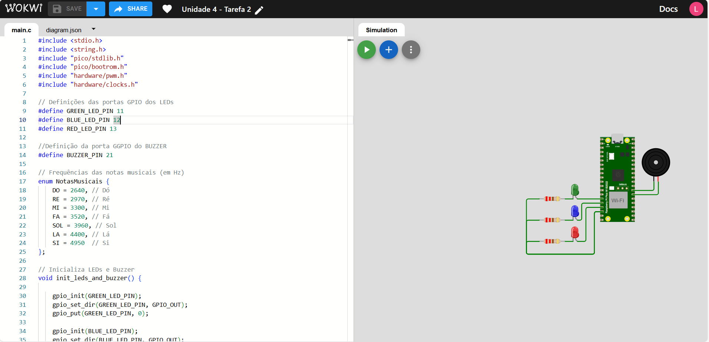

# EmbarcaTech_Unidade4_Tarefa2.

  

## Atividade 2 (Participativa): Controle de pinos GPIO da ferramenta educacional BitDogLab.

## Descrição do Projeto

Este projeto visa controlar pinos GPIO do microcontrolador RP2040, presente na placa de desenvolvimento Raspberry Pi Pico W, utilizando a ferramenta educacional BitDogLab. Através do uso da porta serial UART, controlamos o acionamento de um LED RGB (conectado aos GPIOs 11, 12 e 13) e de um buzzer (conectado ao GPIO 21). Os comandos são enviados via interface serial para o microcontrolador interpretar e realizar o controle dos periféricos.

## Componentes Utilizados

- **03 LEDs RGB**: Utilizados para a sinalização visual de diferentes estados.
- **Buzzer**: Utilizado para emitir sinais sonoros.
- **Microcontrolador Raspberry Pi Pico W (RP2040)**: Responsável pelo controle dos pinos GPIO.

## Ambiente de Desenvolvimento

- **VS Code**: Ambiente de desenvolvimento utilizado para escrever e debugar o código.
- **Linguagem C**: Linguagem de programação utilizada no desenvolvimento do projeto.
- **Pico SDK**: Kit de Desenvolvimento de Software utilizado para programar a placa Raspberry Pi Pico W.
- **Simulador Wokwi**: Ferramenta de simulação utilizada para testar o projeto.

## Guia de Instalação

1. Clone o repositório:
2. Importe o projeto utilizando a extensão da Raspberry Pi.
3. Compile o código utilizando a extensão da Raspberry Pi.
4. Insira o UF2 na placa em modo bootsel.
5. Utilize o Putty ou similar para a comunicação serial.

## Guia de Uso

Para cada comando, existe uma funcionalidade. Abaixo estão listadas cada uma delas:

| Comando | Função                                   |
|---------|------------------------------------------|
| green   | Acende LED verde                         |
| blue    | Acende LED azul                          |
| red     | Acende LED vermelho                      |
| white   | Acende todos os LEDs                     |
| desligar| Desliga todos os LEDs                    |
| buzzer  | Aciona o Buzzer por 2 segundos           |
| musica1 | Toca a música Do-Re-Mi-Fa                |
| musica2 | Toca a música Parabéns para você         |
| musica3 | Toca a música Cai Cai Balão              |
| musica4 | Toca a música Twinkle Twinkle Little Star|
| musica5 | Toca a música Jingle Bells               |
| musica6 | Toca a música Noite Feliz                |
| musica7 | Toca a música Borboletinha               |
| musica8 | Toca a música Pirulito que Bate Bate     |
| musica9 | Toca a Sinfonia n.º 9 (Beethoven)        |
| musica* | Toca a música tema do Super Mario        |
| sair    | Encerra e entra no modo bootsel          |

## Testes

Testes básicos foram implementados para garantir que cada componente está funcionando corretamente. 

## Colaboradores

- **Líder do Projeto**: [Lucas Gabriel Ferreira](https://github.com/usuario-lider)
- **Desenvolvedores**:
    - [Ângelo Miguel](https://github.com/micheltechEr)
    - [Maria Luiza Brasil Medrado](https://github.com/MariaLuizaBM)
    - [Matheus Capuchinho](https://github.com/Mathz0)
    - [Mateus Soares](https://github.com/mateussoaress)

## Link do Simulador Wokwi
Clique na imagem

  

## Vídeo da Solução

Assista ao vídeo ensaio que demonstra a solução trabalhada e os resultados obtidos nos experimentos:

  

